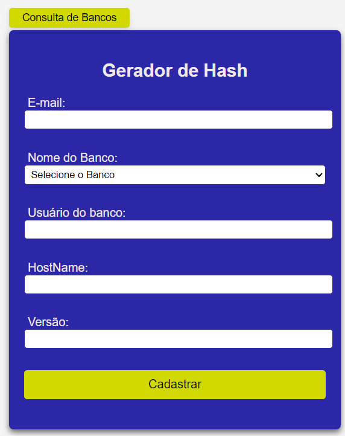

### FUNCIONAMENTO DA APLICAÇÃO:
#### Status Deploy: 

    Estrutura da Aplicação
    
    app
    |--static
        | --index.html
    |--createkey.py
    |--main.py 
    |--shar256.py
    |--basemodel.py
    |--info_rds_awsconfig.py
    |--routes.py
    |--my_msal.py
    READM.MD
     
### Criação do HASH 

    - O painel de acesso `(app/static/index.html)`, receberá os inputs que serão encaminhados para API.

    - A construção da API  foi baseada na FastApi, possuindo apenas os operadores de GET que recebe os parâmetros do painel de acesso e o POST, que realizada a consulta e construção se necessário do secret no AWS secret manager.

    - Durante o processo de POST, a applicação chama uma função `(create_or_update_secret)` que consta dentro da createkey.py, essa função realiza a concatenação do nome+resourcename e realiza uma consulta dentro do AWS Secret Manager.

    - Ao realizar a consulta, existem duas opção a serem realizadas `(Try/except)`, apenas retornar o password_hash caso já existe esse usuário no secret, ou realiza a criação do usuário.

    -> Processo de criação do usuário:

    - O createkey.py chama duas funções existentes dentro do shar256.py, uma dela onde é criado uma senha aleatória de 12 digitos `(generator_pwd)` e outra que utiliza dessa senha aleatória para criar um hash `(pg_scram_sha256)` ou `(pg_md5_hash)`. O que diferencia o tipo de crição do hash será a versão do Postgre.

    - Após ambos os passos concluídos, através da biblioteca boto3 `(secretsmanager)`, todos os campos(userEmail, username, dbname, host, password_hash, password e Engineversion) que são necessário para armazenar no aws secret manager são preenchidos e desta forma é criada a secret.

### Consulta dos Bancos existentes

    - Dentro do routes.py existe um método GET que realiza a consulta dos bancos de dados existentes dentro da AWS, esse método faz uma solicitação através do info_rds_awsconfig.py que utiliza o AWS Config para gerar uma tabela.

    - A tabelas gerada passa por alguns tratamentos antes de ser disponibilizado na interface, por exemplo, inclusão e tratamento da coluna DNS

    - Além de gerar a consulta com todos os dados do banco, esse processo também atualizada o drowdrop da interface da aplicação.

### Criação de senha e retorno da criptografia:

    Usuário deverá incluir as informações na tela de criftografia conforme imagem abaixo
    
    - Ao selecionar o Nome do Banco, automaticamente os campos hostname e versão serão preenchidos

    - Importante armazenar o retorno dessa solicitação

