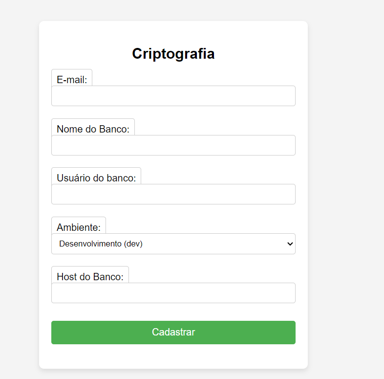

## FUNCIONAMENTO DA APLICAÇÃO

Estrutura básica
--

o Painel de acesso (app/static/index.html), receberá os inputs que serão encaminhados para API.

A construção da API  foi baseada na FastApi, possuindo apenas os operadores de GET que recebe os parametros do painel de acesso e o POST, que realizada a consulta e construção se necessário do secret no secret manager.

Durante o processo de POST, a applicação chama uma função (create_or_update_secret) que consta dentro da createkey.py, essa função realiza a concatenação do nome+ambiente e realiza uma consulta dentro do AWS Secret Manager.

Ao realizar a consulta, existem duas opção a serem realizadas (Try/except), apenas retornar o password_hash caso já existe esse usuário no secret, ou realiza a criação do usuário.

Processo de criação do usuário:

- o createkey.py chama duas funções existentes dentro do shar256.py, uma dela onde é criado uma senha aleatória de 12 digitos (generator_pwd) e outra que utiliza dessa senha aleatória para criar um hash(pg_scram_sha256).

após ambos os passos concluídos, através da biblioteca boto3 (secretsmanager), todos os campos(email_usuario, nome_usuario, ambiente, banco_de_dados, host, password_hash, senha) que são necessário para armazenar no aws secret manager são preenchidos e desta forma é criada a secret.

## Criação de senha e retorno da criptografia

Usuário deverá incluir a informações na tela de criftografia conforme imagem abaixo:

